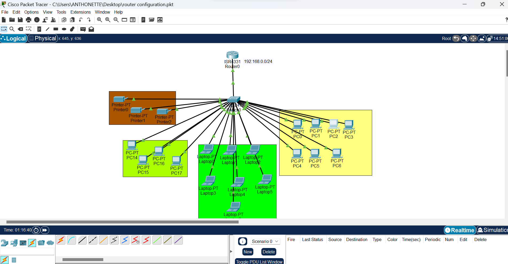

<h1>📡 DHCP Configuration – Cisco Packet Tracer Project</h1>

<h2>📘 Project Overview</h2>

This project demonstrates the configuration and implementation of 
Dynamic Host Configuration Protocol (DHCP) in Cisco Packet Tracer.

<ul>
  <li>A router is configured as a DHCP server.</li>
  <li>Multiple PCs obtain IP addresses dynamically.</li>
  <li>Network connectivity is verified using ping tests.</li>
</ul>

<h2>🖼️ Screenshot Section</h2>

Below is the network topology used in this project:

  

  <em>Figure 1: Cisco Packet Tracer DHCP Network Topology</em>

<h2>🧠 Objectives</h2>
<ul>
  <li>Configure router interfaces with static IP addresses</li>
  <li>Enable DHCP service on the router</li>
  <li>Create DHCP pools</li>
  <li>Exclude specific IP addresses</li>
  <li>Automatically assign IP addresses to client PCs</li>
  <li>Verify connectivity</li>
</ul>

<h2>🖥️ Network Topology</h2>

<table>
<tr>
  <th>Device</th>
  <th>Interface</th>
  <th>IP Address</th>
</tr>
<tr>
  <td>Router</td>
  <td>G0/0</td>
  <td>192.168.1.1</td>
</tr>
<tr>
  <td>PCs</td>
  <td>DHCP</td>
  <td>Assigned Automatically</td>
</tr>
</table>

<h2>⚙️ Step-by-Step DHCP Configuration</h2>

<h3>Step 1: Configure Router Interface</h3>
<pre>
enable
configure terminal
interface gigabitEthernet 0/0
ip address 192.168.1.1 255.255.255.0
no shutdown
exit
</pre>

<h3>Step 2: Exclude IP Addresses</h3>
<pre>
ip dhcp excluded-address 192.168.1.1 192.168.1.10
</pre>

<h3>Step 3: Create DHCP Pool</h3>
<pre>
ip dhcp pool LAN_POOL
network 192.168.1.0 255.255.255.0
default-router 192.168.1.1
dns-server 8.8.8.8
exit
</pre>

<h3>Step 4: Configure PCs</h3>
<ol>
  <li>Click on a PC</li>
  <li>Go to Desktop</li>
  <li>Click IP Configuration</li>
  <li>Select DHCP</li>
</ol>

<h3>Step 5: Verify DHCP Assignment</h3>
<pre>
ipconfig
</pre>

<h3>Step 6: Test Connectivity</h3>
<pre>
ping 192.168.1.1
</pre>

<h2>🎯 Conclusion</h2>

This project demonstrates how DHCP simplifies network administration by automatically assigning IP addresses to devices.

